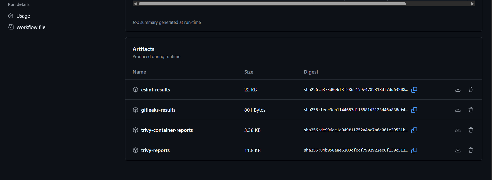

# 🛡️ Shift Left Security in CI/CD Pipeline — Technical Documentation

## 1. Context: Why We Are Doing This

In today’s development landscape, **security cannot be an afterthought**. *Shift Left Security* focuses on embedding security checks early — as code is written and committed — rather than later stages like QA or production.

This implementation aims to:

- Prevent security vulnerabilities from entering the main branch.
- Detect secrets, dependency issues, container risks, and insecure code patterns during pull requests.
- Automate the feedback process for faster and secure development.

---

## 2. Thought Process: POC & Tool Selection

We selected **GitHub Actions** due to:

- Seamless integration with our GitHub repository.
- Support for reusable community actions.
- Flexible trigger strategies (on push, PR, schedule).

### 🔧 Security Tools Implemented

| Check Type                        | Tool                       | Purpose                                                                 |
|----------------------------------|----------------------------|-------------------------------------------------------------------------|
| Static Application Security Testing (SAST) | GitHub CodeQL             | Detect code-level vulnerabilities (e.g., SQL injection, XSS).          |
| Dependency Scanning              | Trivy                      | Identify known vulnerabilities in third-party dependencies.             |
| Code Linting + Security Rules    | ESLint + eslint-plugin-security | Enforce secure code patterns and catch unsafe coding practices.     |
| Secret Scanning                  | Gitleaks                   | Detect hardcoded credentials, tokens, and API keys.                    |
| Container Image Scanning         | Trivy (Image Scanner)      | Scan Docker image layers for CVEs before deployment.                   |

---

### 🧪 Trigger Conditions

- On **push to `main`**
- On **pull requests** targeting `main` or `security-pipeline`
- On a **weekly schedule** (`0 0 * * 0`) for maintenance coverage

📸 **Insert Screenshot 1: GitHub Actions Pipeline View**  
*Show a successful pipeline run with all jobs visible: CodeQL, Trivy, Gitleaks, ESLint, Docker Build.*

---

## 3. Impact Analysis: Benefits, Performance & Challenges

### ✅ Benefits

- **Early Detection**: Catch vulnerabilities before they’re merged.
- **Developer Awareness**: Feedback builds secure coding habits.
- **Automation**: No manual steps needed once integrated.

### 🧠 Key Issues & Resolutions

| Issue                                       | Resolution                                                                 |
|--------------------------------------------|---------------------------------------------------------------------------|
| `jq` formatting error in Gitleaks summary  | Removed invalid `\` characters and restructured JSON parsing in `jq`.    |
| ESLint plugin compatibility issues         | Locked Node.js version and added necessary `eslint-plugin-security`.     |
| Trivy output too verbose                   | Generated both **JSON** and **table** format reports for clarity.        |
| Gitleaks logs were hard to read            | Used `GITHUB_STEP_SUMMARY` to create readable Markdown report in Actions.|

### 📉 Performance Consideration

The security checks add approximately **1.5–2.5 minutes** to the pipeline.  
This is acceptable given the long-term savings from catching issues early.

---

## 4. Conclusion: What We Gain from This

By shifting security left into the CI/CD pipeline:

- We prevent insecure code from reaching production.
- PR reviewers and devs get immediate, contextual feedback.
- The repo becomes more **audit-ready** and **compliant** with security best practices.

### 🚨 What Happens After Each Run:

- ✅ **ESLint** reports insecure patterns in JavaScript code.
- ✅ **CodeQL** flags code-level issues like injection vulnerabilities.
- ✅ **Trivy** lists vulnerable libraries and CVEs.
- ✅ **Gitleaks** detects secrets and sensitive data committed accidentally.
- ✅ **Docker Trivy** reports CVEs in container image layers before pushing to any registry.

---

📸 **Insert Screenshot 2: Gitleaks Markdown Summary Output**  
*Show Gitleaks results rendered inside GitHub Actions with links to commits/secrets.*

📸 **Insert Screenshot 3: ESLint or Trivy Report Artifacts**  

---

## 🗂️ Additional Files

| File Name                         | Purpose                                                  |
|----------------------------------|----------------------------------------------------------|
| `.github/workflows/security.yml` | Core pipeline configuration for GitHub Actions           |
| `eslint-results.json`            | ESLint scan output                                       |
| `gitleaks-results.json`          | Gitleaks secret scan results                             |
| `trivy-reports/`                 | Directory containing Trivy dependency/image scan reports |
| `README.md`                      | Overview of security measures and how to use the results |

---

